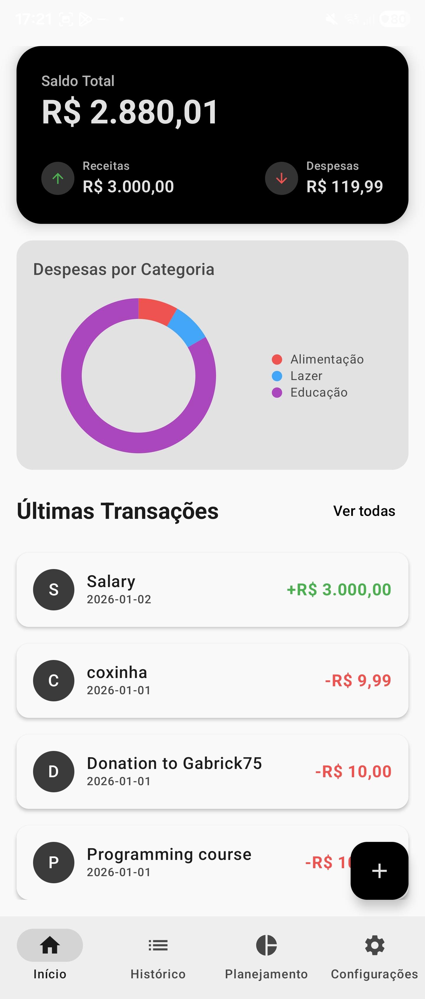
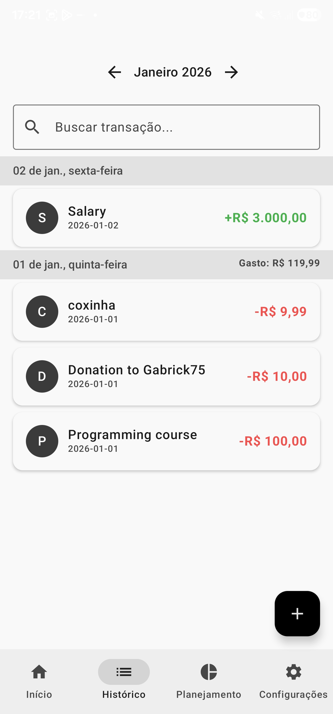
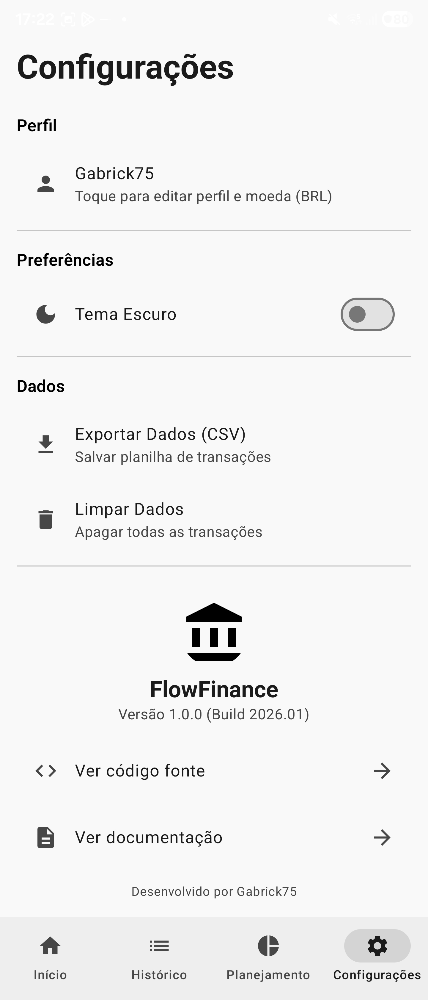
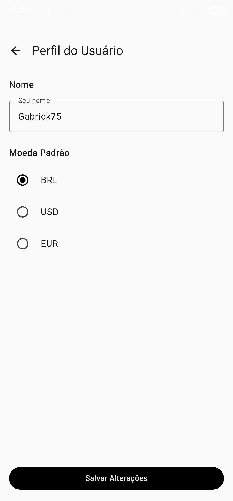

# FlowFinance

FlowFinance is a modern personal finance management app for Android, built to offer an intuitive and powerful budgeting experience. It leverages the latest Jetpack libraries and modern Android development practices, including a 100% Kotlin and Jetpack Compose codebase.

[Leia este README em Português](README.pt-BR.md)

### Main Screenshot
<p align="center">
  
</p>

### More Screenshots
<table>
  <tr>
    <td></td>
    <td></td>
  </tr>
  <tr>
    <td></td>
    <td></td>
  </tr>
</table>


## About The Project

This application was designed to provide detailed monitoring of income and expenses, allowing users to record every financial transaction with specific values and categories. Through a robust data persistence system, the app organizes all information chronologically and generates automatic statistical summaries, helping users understand their spending behavior throughout the month.

The system's operation is based on the reactivity between the database and the user interface. This means any change in financial records is instantly reflected in distribution charts and accumulated totals, without needing manual screen updates.

## Getting Started: A Quick Tutorial

1.  **Add Your First Transaction**: Tap the `+` button on the Dashboard or History screen.
2.  **Fill in the Details**: Enter the amount, a description, choose a category, and select the transaction date.
3.  **Explore Your Finances**: Watch your balance update instantly on the Dashboard and check your full spending history in the "History" tab.
4.  **Customize Your Experience**: Go to the "Settings" tab to change your username, preferred currency, and switch to dark mode.

## Key Features

-   **Reactive Dashboard**: Instantly view your total balance, monthly income, and monthly expenses.
-   **Expense-Distribution Chart**: A custom Pie Chart on the dashboard visualizes spending by category.
-   **Real-time UI**: The interface is fully reactive, updating automatically with any database change, thanks to Kotlin Flow.
-   **Transaction History**: Browse your full transaction history, grouped by date with sticky headers for easy navigation.
-   **Monthly Filters**: Easily navigate between different months to see your financial history.
-   **Swipe-to-Dismiss**: Fluidly delete transactions by swiping them away in the history list.
-   **Budget Planning**: Set and track spending goals by category with progress bars that change color as you approach the limit.
-   **Secure Data Management**: A "Clear Data" option with a confirmation dialog to prevent accidental data loss.
-   **Data Export**: Export all your transaction data to a CSV file to share or analyze elsewhere.
-   **User Personalization**:
    -   Set your username.
    -   Choose your preferred currency (BRL, USD, EUR), which updates formatting across the app.
    -   Switch between a persistent Dark and Light theme.
-   **Automated Backups**: A background worker (WorkManager) automatically performs a weekly backup of the database.

## Technical Stack & Architecture

This project demonstrates a mastery of modern Android development techniques and follows a clean, scalable architecture.

-   **Core**
    -   **Tech Stack**: 100% [Kotlin](https://kotlinlang.org/)
    -   **UI**: [Jetpack Compose](https://developer.android.com/jetpack/compose) for a fully declarative UI.
    -   **Asynchronous Programming**: [Kotlin Coroutines & Flow](https://kotlinlang.org/docs/coroutines-guide.html) for managing background threads and handling data streams.

-   **Architecture**
    -   **Pattern**: MVVM (Model-View-ViewModel) to separate UI from business logic.
    -   **Dependency Injection**: [Hilt](https://developer.android.com/training/dependency-injection/hilt-android) for managing dependencies and creating a scalable structure.
    -   **Navigation**: [Jetpack Navigation for Compose](https://developer.android.com/jetpack/compose/navigation) to handle all in-app navigation.

-   **Data**
    -   **Persistence**: [Room Database](https://developer.android.com/training/data-storage/room) for local, structured data storage with reactive queries.
    -   **User Preferences**: [Jetpack DataStore](https://developer.android.com/topic/libraries/architecture/datastore) for saving user settings like theme and currency.
    -   **Background Tasks**: [WorkManager](https://developer.android.com/topic/libraries/architecture/workmanager) for scheduling reliable background tasks like weekly backups.

## Download

You can download the latest installable version of the app from the [**Releases**](https://github.com/Gabrick75/FlowFinance/releases) page.

## How To Build

To build and run this project, you'll need Android Studio Giraffe (2023.3.1) or newer.

1.  Clone the repository:
    ```sh
    git clone https://github.com/Gabrick75/FlowFinance.git
    ```
2.  Open the project in Android Studio.
3.  Let Gradle sync all the dependencies.
4.  Run the `app` module on an emulator or a physical device.

## Credits

Developed by **Gabrick75.**
